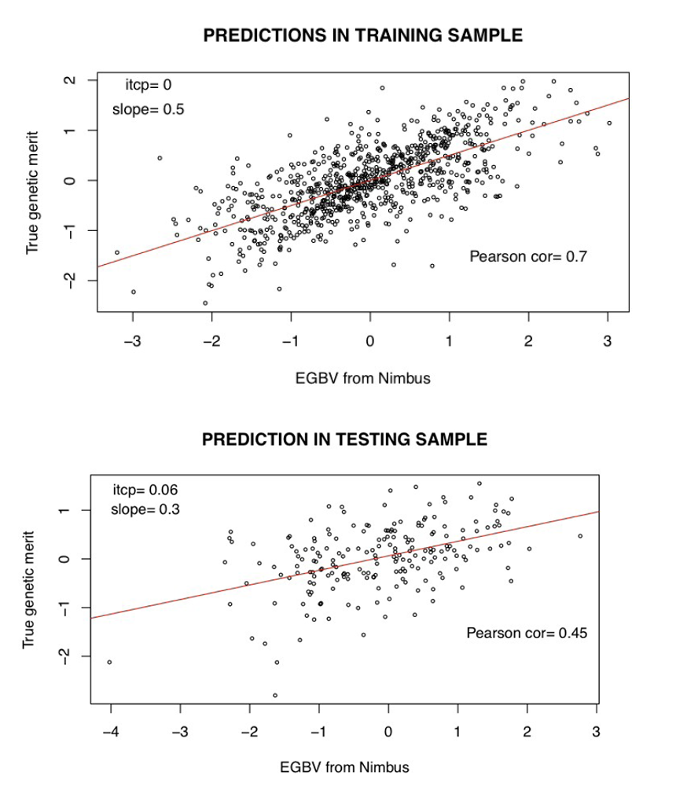

# Summary

Nimbus is a Ruby gem implementing Random Forest in a genomic selection context, meaning every input file is expected to contain genotype and/or phenotype data from a sample of individuals. Other than the ids of the individuals, Nimbus handle the data as genotype values for single-nucleotide polymorphisms (SNPs), so the variables in the classifier must have values of 0, 1 or 2, corresponding with SNPs classes of AA, AB and BB.

Nimbus provides a novel dataframe of random forest under ruby, and implements a modified algorithm that can separate all genotypes for a single marker, which can accommodate both additivity and dominance. Further, it allows the user to specify a loss function and provide full information of the trees in a .yml file.

Nimbus can be used to:

- Create a random forest using a training sample of individuals with phenotype data.

- Use an existent random forest to get predictions for a testing sample.

### Random Forest

The random forest algorithm is a classifier consisting in many random decision trees, it was first proposed as a massively non-parametric machine-learning algorithm by Leo Breiman [@Breiman2001]. It is based on choosing random subsets of variables for each tree and using the most frequent, or the averaged tree output as the overall classification. Random forest makes use of bagging and randomization, constructing many decision trees [@Kamiski2017] on bootstrapped samples of a given data set. The prediction from the trees are averaged to make final predictions.

In machine learning terms, it is an ensemble classifier, so it uses multiple models to obtain better predictive performance than could be obtained from any of the constituent models.

The forest outputs the class that is the mean or the mode (in regression problems) or the majority class (in classification problems) of the node's output by individual trees.

The algorithm is robust to over-fitting and able to capture complex interaction structures in the data, which may alleviate the problems of analyzing genome-wide data.

### Learning algorithm

**Training**: Each tree in the forest is constructed using the following algorithm:

- Let the number of training cases be N, and the number of variables (SNPs) in the classifier be M.

- The mtry number of input variables is told to the algorithm to be used in determining the decision at a node of the tree; m should be much less than M (usually 1/3), and the optimal value should be tuned for methods like grid search.

- Choose a training set for this tree by drawing n samples with replacement from all N available training cases (i.e. bootstrap sampling). The rest of the cases (Out Of Bag sample) will be used to estimate the error of the tree at predicting the classes of this out of Bag samples.

- For each node of the tree, randomly choose m SNPs on which to base the decision at that node. Calculate the best split based on these m SNPs in the training set.

- Each tree is fully grown and not pruned (as may be done in constructing a normal tree classifier).

- When in a node there is not any SNP split that minimizes the general loss function of the node, or the number of individuals in the node is less than the minimum node size then label the node with the average phenotype value of the individuals in the node.

**Testing**: An independent sample can be pushed down the tree to predict the most probable phenotype given the SNP genotypes. It is assigned the label of the training sample in the terminal node it ends up in. This procedure is iterated over all trees in the ensemble, and the average vote of all trees is reported as the random forest prediction.

### Nimbus

Nimbus trains the algorithm based on an input file (learning sample) containing the phenotypes of the individuals and their respective list of genotype markers (i.e. SNPs). A random forest is created and stored in a .yml file for future use.

Nimbus can also be run to make prediction in a validation set or in a set of data containing yet to be observed response variable. In this case, the predictions can be obtained using the random forest created with a learning sample or using a previously stored random forest.

If a learning sample is provided, the gem will create a file with the variable importance of each feature (marker) in the data. The higher the importance is, the more relevant the marker is to correctly predict the response variable in new data.

Nimbus can be used for both classification or regression problems, and the user may provide different parameter values in a configuration file to tune the performance of the algorithm.

-

# References
